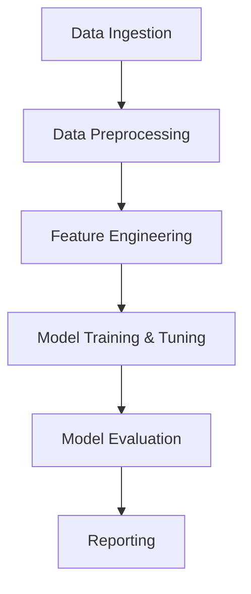

# Pipeline Architecture and Documentation

## Pipeline Overview
The pipeline for Crypto Currency Volatility Prediction is designed to automate the process of data ingestion, preprocessing, feature engineering, model training, evaluation, and reporting. Each stage is modular and reproducible, ensuring clarity and scalability.

## Pipeline Stages

1. **Data Ingestion**
   - Load raw data from `dataset.csv` using pandas.
   - Inspect data structure and types.

2. **Data Preprocessing**
   - Remove unnecessary columns (e.g., `Unnamed: 0`).
   - Encode categorical variables (`crypto_name`).
   - Scale numerical features using MinMaxScaler or StandardScaler.
   - Handle missing values (drop or impute as needed).

3. **Feature Engineering**
   - Create new features: `daily_return`, `volatility`, `liquidity_ratio`, lagged and moving averages.
   - Convert date columns to datetime format.
   - Extract time-based features: year, month, day, weekday, hour.

4. **Model Training & Hyperparameter Tuning**
   - Split data into training and testing sets.
   - Train Random Forest Regressor.
   - Perform hyperparameter tuning using RandomizedSearchCV.
   - Select the best model based on evaluation metrics.

5. **Model Evaluation**
   - Predict on test data.
   - Calculate metrics: Mean Squared Error (MSE), Root Mean Squared Error (RMSE), R² Score.
   - Visualize results: Actual vs Predicted, Feature Importance, Volatility Distribution, Volatility Over Time, Correlation Heatmap.

6. **Reporting**
   - Document all steps, code, and results in Jupyter notebooks and markdown files.
   - Summarize findings and insights.

## Pipeline Flow Diagram

## Documentation

- All code and documentation are provided in:
  - `EDA_Report.ipynb`: Main notebook for pipeline implementation.
  - `sourcecode.md`: Source code documentation.
  - `HLD&LLD.md`: Design documents (HLD & LLD).

## Notes

- The pipeline is modular; each stage can be updated or replaced independently.
- All steps are reproducible and well-commented for clarity.
- The architecture supports easy extension for new features, models, or data sources.

---

You can expand or modify this template as needed for your